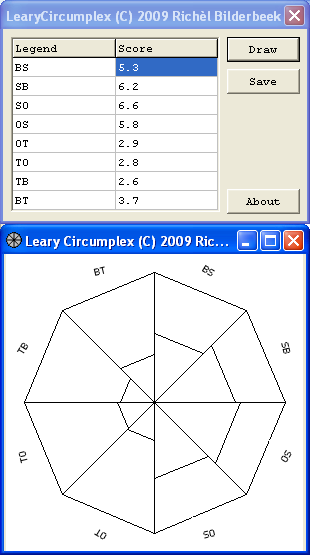

# LearyCircumplex

Branch|
---|---
`master`|

LearyCircumplex is a tool to generate an image of a Leary 
circumplex (also called 'Interpersonal circumplex' or 'Leary circle' 
or (in Dutch) 'Roos van Leary') after having scored the results of 
a questionaire. 

## Downloads

 * [Download the Windows executable](http://www.richelbilderbeek.nl/ToolLearyCircumplexExe_1_0.zip)
 * Videos: [YouTube](https://youtu.be/S15O6htUkjw) [ogv](http://www.richelbilderbeek.nl/leary_circumplex.ogv)

## Links

 * [Wikipedia's page on 'Interpersonal Circumplex'](http://en.wikipedia.org/wiki/Interpersonal_Circumplex)